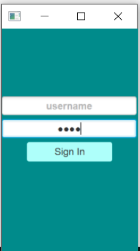
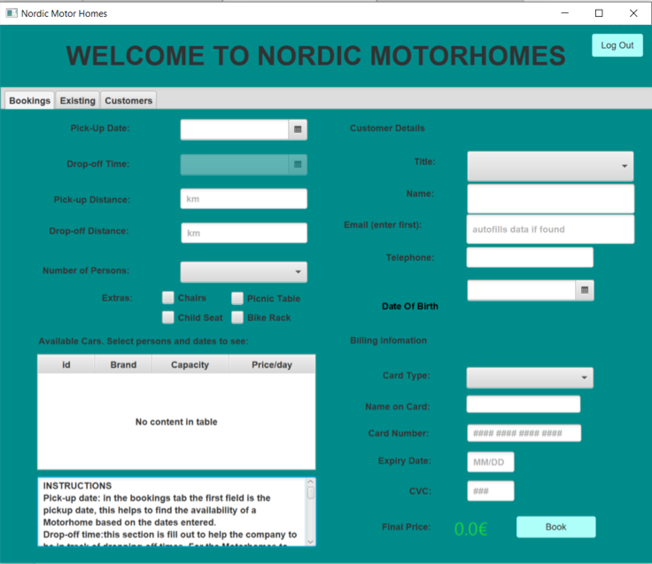
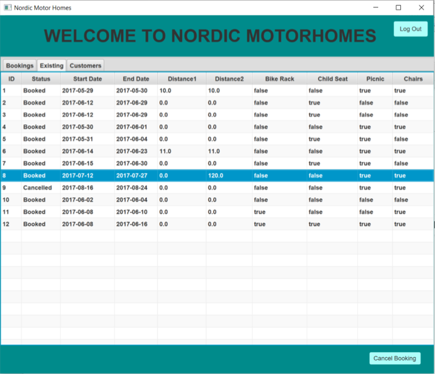
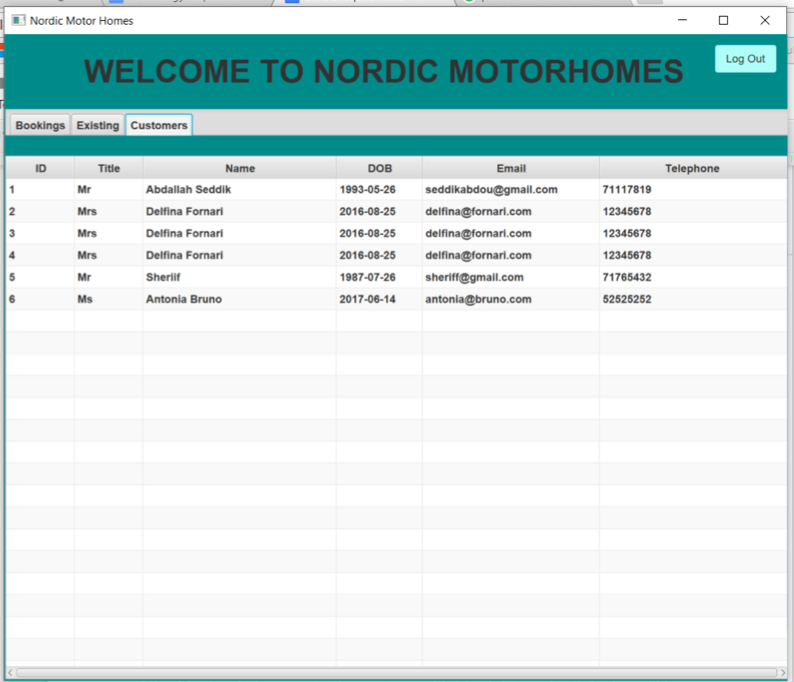
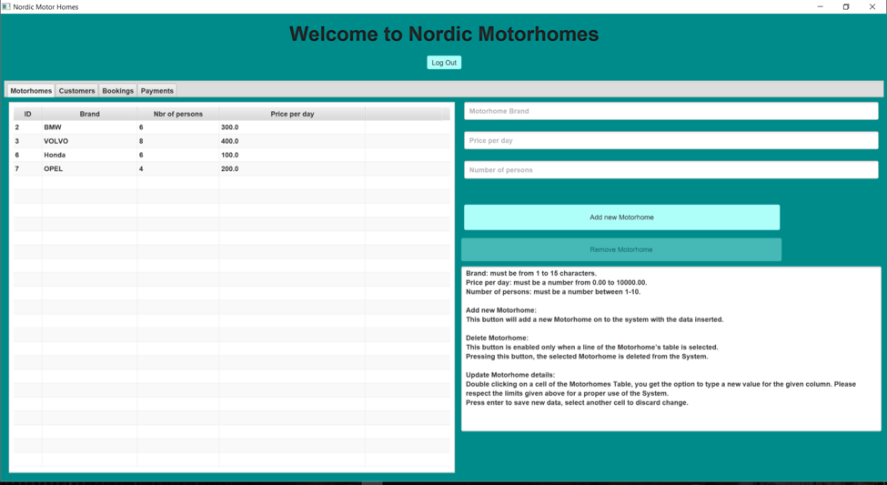
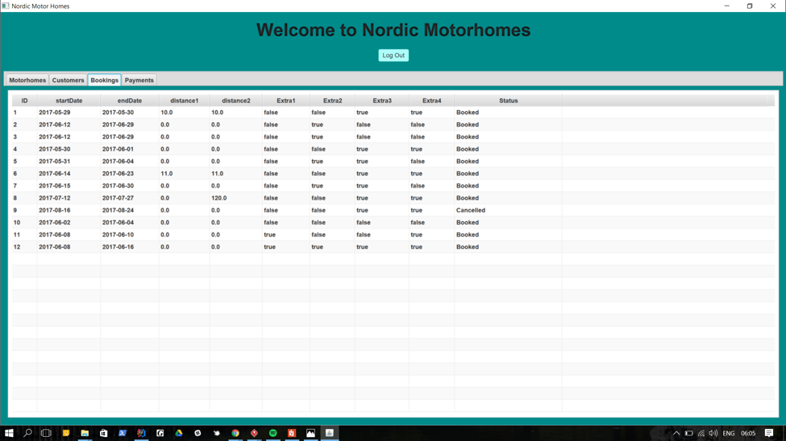
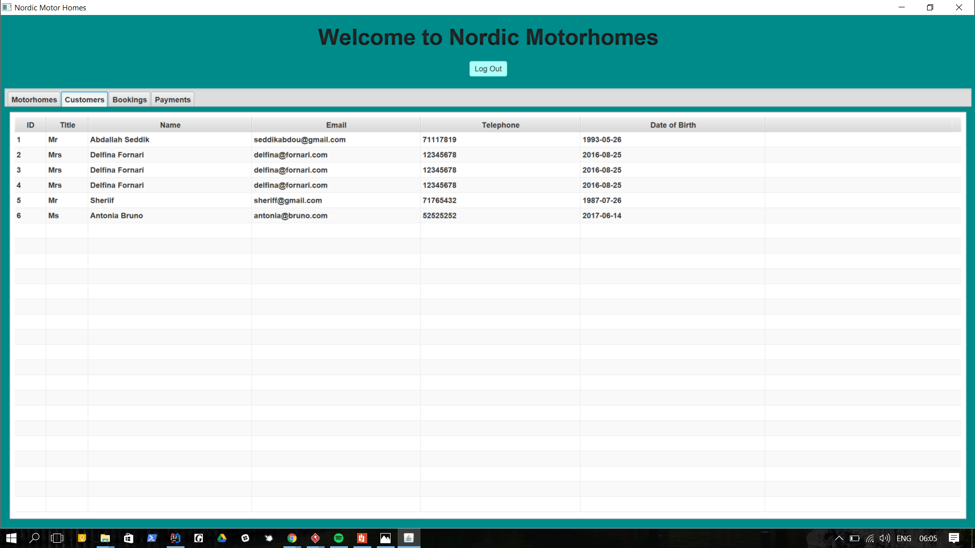
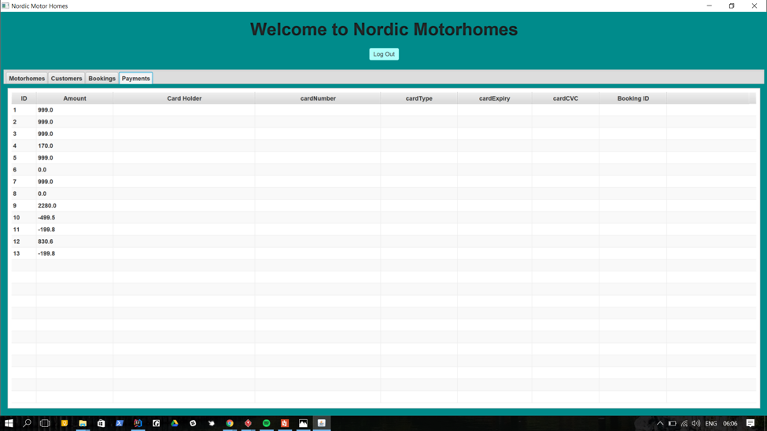
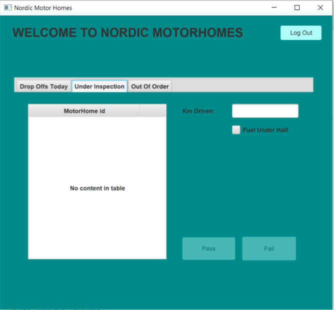

## Vision
A team of four developers is hired to develop an ITS for a young, dynamically growing startup. System is supposed to handle Bookings and Fleet information of the Nordic Motorhomes Aps. Current usability should be oriented towards the company’s sales assistants, bookkeeper and mechanic.

## Screenshots
### Login view

  
### Salesperson views

  
	
  

  

### Bookkeeper views

  

  

  

  
### Mechanic view

